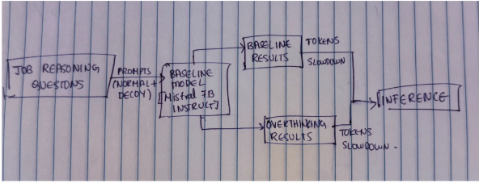
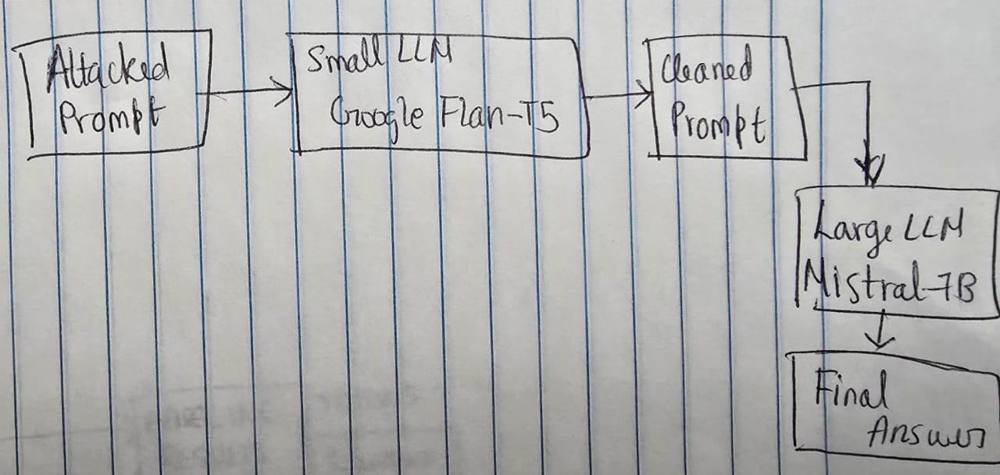

<div align="center">
  
# GROUP 4: EduPilot - Assignment 10
### Job Reasoning and Defense Evaluation in AI Models
*This assignment evaluates AI models on job reasoning tasks, explores overthinking and filtering defenses, and reports key metrics and results.*
**Team Lead:** Sriram Kannan
</div>

---

## Table of Contents

- [Folder Structure](#folder-structure)
- [Environment Setup](#environment-setup)
- [Running the Code](#running-the-code)
- [Model & Experimental Setup](#model--experimental-setup)
- [Results and Evaluation](#results-and-evaluation)
- [Plots and Visualization](#plots-and-visualization)
- [Limitations and Future Work](#limitations-and-future-work)

---

## Folder Structure

```text
assignment-10/
├── compute_metrics.py                        # Merge results, compute slowdown, overthink, and comparison metrics
├── defense_paraphrase_eval.py                # Evaluate paraphrasing-based defense strategies
├── environment.yml                           # Conda environment file
├── filtering_defense.ipynb                   # Filtering-based defense experiments (notebook)
├── filtering_defense.py                      # Filtering defense evaluation (script)
├── job_reasoning_eval.py                     # Main script: evaluate models on job reasoning
├── plot_overthink_defenses_using_paraphrase_and_filtering.py  # Plot comparisons
├── WebAttack_ExtraCredit.ipynb               # Extra credit: web-based attack experiments
├── artifacts/
│   ├── job_reasoning_questions.csv           # Dataset of job reasoning scenarios
│   ├── merged_all_attacks.csv                # Aggregated results (all attacks/defenses)
│   ├── merged_results.csv                    # Combined results for metrics
│   ├── results_baseline.csv                  # Baseline model predictions
│   ├── results_defended_paraphrase_mdp.csv   # Paraphrase defense (MDP)
│   ├── results_mdp.csv                       # MDP model predictions
├── Plots/
│   ├── Combined/                             # Plots: all models/defenses
│   ├── MDP/                                  # Plots: MDP model
│   └── Sudoku/                               # Plots: Sudoku model
```

---

## Environment Setup

1. Install [Miniconda](https://docs.conda.io/en/latest/miniconda.html) or [Anaconda](https://www.anaconda.com/products/distribution).
2. Create the environment:
   ```bash
   conda env create -f environment.yml
   ```
3. Activate the environment:
   ```bash
   conda activate job-reasoning
   ```

---

## Running the Code & Script Details

### 1. Evaluate Job Reasoning (`job_reasoning_eval.py`)
**What it does:**
- Runs a model on job reasoning questions, either as a baseline (no attack) or with an attack prompt (e.g., Sudoku or MDP decoy) prepended.
- For each question, outputs the model’s answer and the number of reasoning tokens (how verbose the model’s reasoning is).
- Does not compute metrics or compare results, just runs the model and saves its outputs for each question.

**Usage:**
```bash
python job_reasoning_eval.py --csv job_reasoning_questions.csv --out results_baseline.csv
python job_reasoning_eval.py --csv job_reasoning_questions.csv --out results_overthink.csv --attack --attack-variant sudoku
```

**Inputs:**
- `job_reasoning_questions.csv` — Dataset with 'question' and 'ground_truth' columns.

**Outputs:**
- `artifacts/results_baseline.csv` — Model predictions on original (clean) questions (baseline run).
- `artifacts/results_overthink.csv` — Model predictions with attack prompt (e.g., Sudoku or MDP decoy) (attacked run).
  - Each file contains columns such as `id`, `question`, `reasoning_tokens`.
    - `reasoning_tokens`: Number of tokens in the model's reasoning output (measures verbosity/overthinking).

---

### 2. Apply Defenses

#### a) Paraphrase Defense (`defense_paraphrase_eval.py`)

**What it does:**
- Applies a paraphrasing defense to attacked prompts (Sudoku/MDP), rewriting them to remove distractions before model evaluation.
- Evaluates the defended prompts using a reasoning model.
- Computes and outputs slowdown metrics (how much longer the model's reasoning becomes under attack/defense).

**Usage:**
```bash
# Defend only Sudoku attack
python defense_paraphrase_eval.py --csv job_reasoning_questions.csv --variant sudoku --out-sudoku results_defended_paraphrase_sudoku.csv
# Defend only MDP attack
python defense_paraphrase_eval.py --csv job_reasoning_questions.csv --variant MDP --out-mdp results_defended_paraphrase_mdp.csv
# Defend both
python defense_paraphrase_eval.py --csv job_reasoning_questions.csv --variant both --out-sudoku results_defended_paraphrase_sudoku.csv --out-mdp results_defended_paraphrase_mdp.csv
```

**Inputs:**
- `job_reasoning_questions.csv` — Dataset with 'question' and 'ground_truth'.

**Outputs:**
- `results_defended_paraphrase_sudoku.csv` — Results for Sudoku attack after paraphrasing defense.
- `results_defended_paraphrase_mdp.csv` — Results for MDP attack after paraphrasing defense.
  - Columns: `id`, `question`, `paraphrased_prompt`, `model_answer`, `reasoning_tokens`,`slowdown`, etc.
    - `paraphrased_prompt`: The cleaned, task-focused prompt sent to the model.
    - `model_answer`: Model's answer after defense.
    - `reasoning_tokens`: Number of tokens in the model's reasoning output (measures verbosity/overthinking).
    - `slowdown`: Ratio of reasoning tokens in the defended/attacked output to the baseline (higher = more verbose/slow).

#### b) Filtering Defense (`filtering_defense.py`)
**What it does:**
- Implements a lightweight LLM-based filtering defense to remove irrelevant or adversarial content from prompts before model evaluation.
- Uses a small model for filtering and a large model for reasoning (with memory optimizations).

**Usage:**
```bash
python filtering_defense.py --csv job_reasoning_questions.csv --out results_filtering.csv --limit 20
```

**Inputs:**
- `job_reasoning_questions.csv` — Dataset with 'question' and 'ground_truth'.

**Outputs:**
- `results_filtering.csv` — Results after filtering defense.
  - Columns: `id`, `question`, `filtered_context`, `model_answer`, `reasoning_tokens`
    - `filtered_context`: The prompt after filtering out distractions.
    - `model_answer`: Model's answer after filtering defense.
    - `reasoning_tokens`: Number of tokens in the model's reasoning output (measures verbosity/overthinking).

---


### 3. Compute Metrics (`compute_metrics.py`)
**What it does:**
- Loads the results from baseline and attacked runs (e.g., from `job_reasoning_eval.py`).
- Merges these results by question ID.
- Computes:
  - **Token Overhead:** Difference in reasoning tokens between attack and baseline.
  - **Slowdown:** Ratio of reasoning tokens (attack/baseline).
  - **Similarity Drop:** Change in cosine similarity between outputs.
- Saves a merged CSV with these metrics and generates plots comparing token usage, overhead, and slowdown across conditions.

**Usage:**
```bash
python compute_metrics.py \
    --base results_baseline.csv \
    --sudoku results_overthink.csv \
    --mdp results_mdp.csv \
    --out merged_all_attacks.csv \
    --plots Plots
```
All arguments are optional; defaults are provided for typical use.

**Inputs:**
- `results_baseline.csv` — Baseline model results
- `results_overthink.csv` — Sudoku attack results
- `results_mdp.csv` — MDP attack results

**Outputs:**
- `merged_all_attacks.csv` — Unified results with computed metrics
- Plots in the `Plots/` directory:
  - `baseline_vs_sudoku_line.png` — Token usage comparison
  - `baseline_vs_mdp_line.png` — Token usage comparison
  - `overhead_sudoku_mdp.png` — Token overhead bar chart
  - `slowdown_sudoku_mdp.png` — Slowdown ratio bar chart
    - These plots visualize how much more verbose or slow the model becomes under attack, and how defenses help.

**Design & Robustness:**
- Ensures plot directory exists before saving.
- Aligns datasets by ID for consistent merging.
- Prints status messages for each major step.

---

### 4. Visualize Results (`plot_overthink_defenses_using_paraphrase_and_filtering.py`)
**What it does:**
- Generates a bar chart comparing reasoning token usage across Baseline, Attack, and Filtering Defense conditions.

**Usage:**
```bash
python plot_overthink_defenses_using_paraphrase_and_filtering.py
```

**Inputs:**
- `results_baseline.csv`, `results_overthink.csv`, `results_filtering.csv` — Results from previous scripts.

**Outputs:**
- `defense_token_comparison.png` — Bar chart showing average reasoning tokens for each condition.
    - Helps visualize the effectiveness of defenses in reducing unnecessary reasoning/overthinking.

---
## Model and Experimental Setup with Design Justification
### Dataset and Rationale

For this assignment, I created a custom dataset of **8 job reasoning prompts**, each with a corresponding ground truth answer. These prompts are included in `artifacts/job_reasoning_questions.csv`.

**Why job-based prompts?**
- I chose job reasoning scenarios because they are highly relevant to our startup idea, which focuses on AI-driven job search and prep. In real-world hiring, recruiters and interviewers often face nuanced, open-ended questions that require judgment, context, and reasoning—exactly the kind of tasks that LLMs are now being used for.
- By focusing on job reasoning, I wanted to evaluate not just generic QA, but the model's ability to handle realistic, high-impact scenarios that matter in professional settings. This also lets me measure the real-life impact of overthinking and defense strategies in a domain where prompt quality and answer reliability are critical.

**Dataset details:**
- Each prompt is a realistic job reasoning or hiring scenario, such as evaluating a candidate's experience, interpreting resume details, or making hiring recommendations.
- The ground truth answers are concise, that reflect what a skilled recruiter or hiring manager would say according to GPT-5.
- The dataset is small (8 prompts) to allow for detailed, qualitative analysis and to keep experiments tractable given compute constraints.

### Pipeline (Architecture Overview)

The following pipeline matches my architecture diagram:

<div align="center">
  <br>
  <span style="display:block; margin-top:8px; font-size: 1.05em;"><b>Figure:</b> Pipeline Architecture Diagram</span>
</div>

**Pipeline Steps (Concise, with Defense):**

1. **Input:** Start with job reasoning questions.
2. **Prompt Construction:** For each question, create both a normal (baseline) prompt and a decoy (attacked) prompt.
3. **Baseline Path:**
  - Feed both prompt types to the baseline model (Mistral-7B-Instruct).
  - Collect baseline results (from normal prompts) and overthinking results (from decoy prompts).
  - Extract reasoning tokens and compute slowdown for both.
4. **Defense Path:**
  - Pass attacked prompts through a defense model (paraphrasing or filtering) to produce clean prompts.
  - Feed clean prompts to the baseline model.
  - Collect defense results and extract reasoning tokens and slowdown.
5. **Inference & Analysis:**
  - Compare baseline, overthinking, and defense results on tokens and slowdown for each question.


### Model & Inference Settings

- **Model:** Mistral-7B-Instruct
- **Inference Framework:** HuggingFace Transformers
- **Hardware:** GPU with ~16GB VRAM

**Why I Use an Instruct Model?**
> From my experience in [Assignment-5](../assignment-5/README.md#model-design-with-justification), I found that the Mistral-7B-Instruct model is specifically designed to follow instructions and provide step-by-step reasoning. This makes it a realistic target for both attacks and defenses in job reasoning tasks. I use an instruct-tuned model because I want the evaluation to reflect real-world usage, where users expect clear, detailed, and helpful answers. I also observed that this model is more susceptible to overthinking attacks (since it tries to be thorough), but also more responsive to defense strategies like paraphrasing and filtering. By evaluating attack and defenses on an instruct model, I believe I get a fair and practical assessment of how well these methods can mitigate resource abuse in actual deployment scenarios.

**My Generation Settings (and Why):**

- `temperature=0.0`: set this to remove randomness for a fully deterministic, fair baseline vs. overthinking comparison.
- `top_p=1.0` and `do_sample=False`: use these to ensure greedy decoding (no sampling), so outputs are stable and comparable.
- `max_new_tokens=20486`: keep reasoning lengths bounded and comparable and enough for the model to generate reasoning (I observed that more token len more time it took to run but better results, as I had enough token to differentiate between baseline and overthink prompts)
- `repetition_penalty=1.05`: apply this to prevent the model from looping or repeating phrases during long reasoning, ensuring meaningful token counts.
- `pad_token_id=EOS`: set this to avoid tokenization mismatches, which is important when measuring token overhead.

**Design Rationale:**
- All these settings are chosen to enforce fully deterministic, stable, and comparable outputs by disabling sampling, fixing generation length bounds, preventing repetition loops, and ensuring identical tokenization behavior across baseline and overthinking evaluations. This way, any differences in output length or content are due to the attack/defense and not random variation.

- I use identical generation settings for both baseline and overthinking runs to ensure fairness.

**Overthinking (Context Agnostic Decoy):**

- In my attack setup, I prepend a Sudoku and MDP decoy to the prompt to induce unnecessary reasoning and inflate resource usage.
- These decoys are "context-agnostic" because they are unrelated to the actual job reasoning question, so they can distract or overload the model regardless of the question content. This helps me test the model's robustness to irrelevant or adversarial input.

**Defenses:**
- *Paraphrasing Defense:* I use a two-model pipeline:
  - **Paraphrasing Stage:** A small, efficient LLM (Google Flan-T5-Base) rewrites the attacked prompt into a shorter, cleaner, task-focused version, removing puzzles, games, or unrelated instructions while preserving the original question intent.
  - **Reasoning Stage:** The paraphrased prompt is then passed to a larger reasoning model (Mistral-7B-Instruct) to generate the final answer.
- *Filtering Defense:* I use a two-model pipeline for efficiency and effectiveness:
  - **Filtering Stage:** A lightweight LLM (Google Flan-T5-Large) is used to scan the prompt and remove any irrelevant, adversarial, or distracting content (such as Sudoku or MDP decoys).
  - **Reasoning Stage:** The cleaned prompt is then passed to a larger, more capable reasoning model (Mistral-7B-Instruct) to answer the core job reasoning question.


<div align="center">
  <br>
  <span style="display:block; margin-top:8px; font-size: 1.05em;"><b>Figure:</b> Two-Model Defense System: Small LLM (Google Flan-T5) for defense, Large LLM (Mistral-7B) for reasoning.</span>
</div>

**My Unified Design Rationale for Both Defenses:**
I use a two-model pipeline for both paraphrasing and filtering defenses: a small, fast LLM (Flan-T5) for pre-processing (either paraphrasing or filtering) and a large, powerful reasoning model (Mistral-7B-Instruct) for final answer generation. I choose Google Flan-T5 for its speed, reliability, and compatibility with a wide range of hardware, making it ideal for efficient, automated prompt cleaning. This separation ensures that distracting or adversarial content is neutralized before the main model reasons over the prompt, reducing the risk of overthinking and resource abuse. I find this approach efficient, robust, and hardware-friendly, as the heavy computation is only spent on relevant, cleaned input, and I can leverage the same defense model architecture for both strategies.

---

## Results and Evaluation

**Results Files:**

- `artifacts/results_baseline.csv` — Baseline predictions
- `artifacts/results_mdp.csv`, `artifacts/results_sudoku.csv` — Model-specific results
- `artifacts/results_defended_paraphrase_mdp.csv`, etc. — Defended model results
- `artifacts/results_filtering.csv` — Filtering defense results
- `artifacts/merged_results.csv`, `artifacts/merged_all_attacks.csv` — Aggregated results


**Metrics:**

- **Slowdown:** 
    - Measures how much longer (in terms of reasoning tokens) the model's output becomes under attack or defense compared to the baseline. It is computed as the ratio of reasoning tokens in the attacked/defended output to the baseline output, i.e., `slowdown = reasoning_tokens_attack / reasoning_tokens_baseline`. 
    - Higher values indicate the model is being forced to reason more (often unnecessarily), which can signal successful distraction or overthinking.

- **Overthink (Reasoning Tokens):** 
    - Refers to the number of tokens in the model's reasoning output. This is computed as the difference in token count between the output and the input prompt, i.e., `reasoning_tokens = output_token_count - input_token_count`. 
    - A higher value means the model is providing more verbose or step-by-step reasoning, which can be a sign of overthinking, especially under attack or when defenses are applied. This metric is used to compare how much extra reasoning is induced by attacks or mitigated by defenses.

---

## Limitations and Future Work


**Limitations:**

- The dataset is small (8 prompts) and focused on job reasoning, which enables deep qualitative analysis but limits statistical generalizability to broader domains or larger populations.
- All prompts are crafted by me, but may not capture the full diversity of real-world job reasoning or adversarial attack strategies.
- Only a limited set of attack types (Sudoku, MDP decoys) and defense mechanisms (paraphrasing, filtering) are explored; other adversarial techniques and mitigation strategies remain untested.
- Evaluation is based on a single instruct-tuned model (Mistral-7B-Instruct) and specific generation settings, so results may not transfer directly to other models or configurations.
- Resource constraints (GPU memory, compute time) restricted the scale and number of experiments, especially for larger models or more complex defenses.

**Future Work:**

- Expand the dataset to include a wider range of job reasoning scenarios, more diverse question types, and adversarial attacks drawn from real-world hiring data or user studies.
- Investigate additional defense strategies, such as adversarial training, prompt validation, or ensemble methods, and evaluate their effectiveness against a broader set of attacks.
- Test the pipeline on different LLM architectures (e.g., GPT-4, Llama-2, Claude) and compare robustness and defense transferability across models.
- Develop more nuanced evaluation metrics that capture not just token overhead and slowdown, but also answer quality, faithfulness, and user satisfaction.
- Automate the defense pipeline for real-time deployment in job search or hiring platforms, and conduct user studies to assess real-world impact and usability.

---
