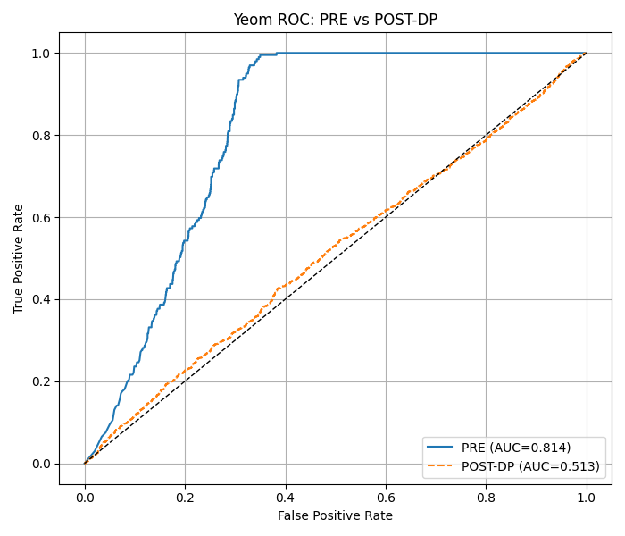

<div align="center">

# EduPilot

### Analysis of Differential Privacy Techniques on Balanced Synthetic Job Data

*This project investigates the impact of differential privacy (DP) techniques on neural network models for job role classification, using a synthetic, balanced dataset and a simple yet effective 2-layer MLP architecture.*

**Team Lead:** Swetha Saseendran  
</div>

---

### Quick Navigation
- [Folder Structure](#folder-structure)
- [Environment Setup](#setting-up-the-conda-environment)
- [Hyperparameter Tuning Modules](#hyperparameter-tuning-modules)
  - [Privacy Accounting Comparison](#privacy-accounting-comparison-strong_vs_moments_accountantpy)
  - [Noise Sweep](#noise-sweep-analyze_noisepy)
  - [Clipping Norm Sweep](#clipping-norm-sweep-analyze_clippy)
  - [Other Hyperparameter Sweep](#other-hyperparameter-sweep-analyze_miscellanous_paramspy)
  - [Parameter Sweep Utility](#parameter-sweep-utility-param_sweeppy)
- [Main Training Module](#main-training-module)
  - [Baseline vs DP Training](#baseline-vs-dp-training-train_dp_modelpy)
- [MIA Analysis](#mia-analysis)
  - [Threshold-based MIA](#threshold-based-mia-mia_attack_thresholdipynb)
  - [Loss-Threshold-Attack-Model](#loss-threshold-attack-model)

---

<!-- 
## Model Setting and Dataset Generation
The model used is a 2-layer feedforward neural network (multilayer perceptron, MLP) with the following structure:

- **Input:** TF-IDF features (`max_features=258`)
- **Hidden layer:** size is swept (default 128, but can be 64, 128, ..., 1024)
  - `nn.Linear(input_dim, hidden_units)`
  - `nn.ReLU()`
- **Output layer:** number of classes
  - `nn.Linear(hidden_units, num_classes)`

This architecture is implemented in the `make_model` function in the script.


For a 2-layer MLP, the number of trainable parameters is:

- **Layer 1:**
  - Weights: `input_dim × hidden_units`
  - Biases: `hidden_units`
  - Total: `input_dim × hidden_units + hidden_units`
- **Layer 2:**
  - Weights: `hidden_units × num_classes`
  - Biases: `num_classes`
  - Total: `hidden_units × num_classes + num_classes`
- **Total:**
  - `params_l1 + params_l2` -->

## Folder Structure

The assignment is organized into the following main directories. Please follow this below structure to view the files needed.<br/>

**Main Folders to look at: ```Hyperparam_Tuning/``` and ``` Main_Baseline_Vs_BestDP/ ```.**


The other folders are for extra credit: <br/>
MIA ATTACK:
- ```Threshold_MIA_Colab/``` <br/>

We also testing a new model (more complex model) so see how it has affect on privacy:
- ```test```

#### Folder Structure
```
code/
├── data/
    └── dataset.csv                       # Main dataset for train

├── Hyperparam_Tuning/                    # Parameter analysis modules
    ├── analyze_clip.py                   # Clipping norm analysis
    ├── analyze_noise.py                  # Noise multiplier analysis  
    ├── analyze_miscellanous_params.py    # Other hyperparameters
    ├── param_sweep.py                    # General parameter sweep utility
    └── strong_vs_moments_accountant.py   # Privacy accounting comparison

├── Main_Baseline_Vs_BestDP/              # Main training comparison from param tuning
   └── train_dp_model.py                  # Baseline vs Best DP model train

└── Threshold_MIA_Colab/                  # Membership Inference Attack analysis (EXTRA CREDIT)
    ├── dataset.csv                       # Small subset dataset for MIA
    └── MIA_Attack_Threshold.ipynb        # MIA analysis notebook
```

---

## Setting Up the Conda Environment

To create the conda environment and install all dependencies for this assignment:

1. Make sure you have [Miniconda](https://docs.conda.io/en/latest/miniconda.html) or [Anaconda](https://www.anaconda.com/products/distribution) installed.
2. Open a terminal and navigate to the `assignment-3/code` directory:
  ```bash
  cd assignment-3/code
  ```
3. Create the environment using the provided `environment.yml` file:
  ```bash
  conda env create -f environment.yml
  ```
4. Activate the environment:
  ```bash
  conda activate 690f
  ```
5. All required dependencies will be installed automatically. If you add new packages, update the environment with:
  ```bash
  conda env update -f environment.yml --prune
  ```

You are now ready to run the scripts in this assignment.

---


## Hyperparameter Tuning Modules

All hyperparameter tuning scripts are located in `code/Hyperparam_Tuning/`. These modules help identify optimal settings for DP-SGD training.

### 1. Privacy Accounting Comparison- strong_vs_moments_accountant.py

This module compares two differential privacy accounting methods used in training machine learning models with DP-SGD:

- **Moments Accountant (MA)** (implemented in Opacus)
- **Strong Composition Theorem**

It helps visualize how the privacy budget **ε (epsilon)** grows across training epochs under each method.

---
#### Purpose

- Provide a **side-by-side comparison** of privacy accounting techniques.  
- Demonstrate that **Moments Accountant yields tighter bounds** on ε than Strong Composition.  
- Serve as a reference plot for how important Moments Accountant is.

---
#### Settings

- **Model**: 2-layer feedforward NN with ReLU, hidden size = 128  
- **Features**: TF-IDF vectors from job descriptions (`max_features=258`)  
- **Optimizer**: SGD, lr=0.05  
- **Lot Size**: √N.  
  - Following literature (Abadi et al., Opacus examples), using lot size ~√N balances privacy and utility.  
- **Noise multiplier (σ)**: 1.0  
- **Clipping Norm (C)**: 1.0.  
  - Standard practice, keeps gradients bounded without over-clipping. 
- **Delta (δ)**: 1/N  
- **Optimizer**: SGD, `lr=0.1`.   

---
#### Inputs & Outputs

- **Input**: `dataset.csv` (columns: `job_description`, `job_role`)  
- **Output artifacts** (saved in `artifacts/`):
  - `epsilon_comparison.png` → line plot of ε vs. epochs (MA vs Strong Composition)

---

#### How to Run

```bash
python assignment-3/code/Hyperparam_Tuning/strong_vs_moments_accountant.py
```

### 2.  Noise Sweep - analyze_noise.py

This module evaluates how the **noise multiplier (σ)** affects the performance of DP-SGD when training a text classification model.  
It runs multiple DP models with varying σ values and compares their test accuracy against a non-DP baseline.

---

#### Purpose

- Empirically show the **trade-off between noise and model accuracy** in DP-SGD.  
- Provide intuition for choosing the right noise multiplier in practice.  

---

#### Settings
  
- **Features**: TF-IDF (`max_features=258`, bigrams included).  
- **Model**: 2-layer feedforward NN with hidden size 128.  
- **Lot Size**: √N.  
  - Following literature (Abadi et al., Opacus examples), using lot size ~√N balances privacy and utility.  
- **Epochs**: N / Lot Size.  
  - Ensures each record is expected to be seen about once.  
- **Clipping Norm (C)**: 1.0.  
  - Standard practice, keeps gradients bounded without over-clipping.  
- **Noise Grid**: `[0.1, 0.5, 1, 2, 3, 4, 5]`.  
  - Covers low → high noise regimes, to visualize the accuracy dropoff.  
- **Delta (δ)**: 1/N.  
  - Widely used setting for DP guarantees.

---

#### Inputs & Outputs

- **Input**: `dataset.csv` (columns: `job_description`, `job_role`).  
- **Outputs** (saved in `artifacts_sweep/`):
  - `noise_vs_acc.png` → accuracy vs noise multiplier plot.  
  - Baseline accuracy line (dashed).  
  - Highlight of peak accuracy among DP runs.  

---

#### How to Run

```bash
python assignment-3/code/Hyperparam_Tuning/analyze_noise.py
```

### 3. Clipping Norm Sweep - analyze_clip.py

This module evaluates how the **gradient clipping norm (C)** affects the performance of DP-SGD when training a text classification model. It runs multiple DP models with varying clipping values and compares their test accuracy. I ran the hyper param sweep for different parameters, initially I tested the code with the values suggested in Abadi et al., but after tuning the params, I changed it to what graphically worked better for my synthetic dataset.

---

#### Purpose

- Empirically show the **impact of gradient clipping** on DP-SGD accuracy.  
- Provide intuition for choosing a suitable clipping norm in practice.

---

#### Settings
  
- **Features**: TF-IDF (`max_features=258`, bigrams included).  
- **Model**: 2-layer feedforward NN with hidden size 128.  
- **Lot Size**: √N.  
  - Following literature (Abadi et al., Opacus examples), using lot size ~√N balances privacy and utility.  
- **Epochs**: N / Lot Size.  
- **Noise Multiplier (σ)**: 1.0.  
- **Clipping Grid**: `[0.5×, ..., 2×]` estimated median grad norm (8 values).  
  - Median is estimated from the training data and snapped to the nearest tested value for annotation.  
- **Delta (δ)**: 1/N.  
  - Widely used setting for DP guarantees.

---

#### Inputs & Outputs

- **Input**: `dataset.csv` (columns: `job_description`, `job_role`).  
- **Outputs** (saved in `artifacts/`):
  - `clip_vs_acc.png` → accuracy vs clipping norm plot.  
  - Smoothed accuracy curve (red).  
  - Observed accuracy points (black).  
  - Peak accuracy (green dot).  
  - Median clipping norm (blue dashed line, snapped to nearest tested value).

---

#### How to Run

```bash
python assignment-3/code/Hyperparam_Tuning/analyze_clip.py
```

### 4. Other Hyperparameters - analyze_miscellanous_params.py

So after I analyzed how clipping norm and noise multiplier affected my DP model, I also wanted to investigate how the other params in relation to the model itself helps the DP model attain its best accuracy and epsilon budget. So,this module allows you to sweep and analyze the effect of various hyperparameters about the model itself (hidden layer size, lot size, learning rate) on the accuracy and privacy of a DP-SGD model for job role classification.

---

#### Purpose

- Empirically show how different hyperparameters affect DP-SGD accuracy and privacy (epsilon).
- Help select optimal values for hidden units, lot size, and learning rate for your dataset.

---

#### Settings
After running all the above code I was able to finalize the best clipping norm and noise multiplier.
- **Features**: TF-IDF (`max_features=258`, bigrams included).
- **Model**: 2-layer feedforward NN with hidden size (swept or fixed).
- **Lot Size**: swept or fixed.
- **Learning Rate**: swept or fixed.
- **Clipping Norm (C)**: 0.17 (default - best value from previous analysis).
- **Noise Multiplier (σ)**: 1.5 (default - best value from previous analysis).
- **Delta (δ)**: 1/N.

---

#### Inputs & Outputs

- **Input**: `dataset.csv` (columns: `job_description`, `job_role`).
- **Outputs** (saved in `artifacts/`):
  - `sweep_hidden_smooth.png`, `sweep_lot_smooth.png`, `sweep_lr_smooth.png` (or similar) → accuracy vs swept parameter plots.

---

#### How to Run

```bash
python assignment-3/code/Hyperparam_Tuning/analyze_miscellanous_params.py --sweep <hidden|lot|lr> [--smooth]
```
Examples:
```bash
python assignment-3/code/Hyperparam_Tuning/analyze_miscellanous_params.py --sweep hidden --smooth
```
```bash
python assignment-3/code/Hyperparam_Tuning/analyze_miscellanous_params.py --sweep lot
```
```bash
python assignment-3/code/Hyperparam_Tuning/analyze_miscellanous_params.py --sweep lr --smooth
```

### 5. Parameter Sweep Utility - param_sweep.py

This is a general utility script that supports comprehensive parameter sweeps across C (clipping) and σ (noise multiplier) as given in the question:
- Clip norm C ∈ {0.5, 1.0}
- Noise multiplier σ ∈ {0.5, 1.0, 2.0}

#### How to Run
```bash
python assignment-3/code/Hyperparam_Tuning/param_sweep.py
```

---

## Main Training Module

The main training comparison is located in `code/Main_Baseline_Vs_BestDP/`.

### Baseline vs DP Training: train_dp_model.py

This module compares the training and test accuracy of a non-private (baseline) model and a differentially private (DP-SGD) model on the job role classification task. It supports flexible privacy settings via command-line arguments.

---

#### Purpose

- Show the effect of differential privacy (DP-SGD) on model accuracy compared to a non-private baseline.
- Visualize privacy consumption (epsilon) over epochs when using DP-SGD.
- Allow experimentation with different privacy budgets and noise multipliers.

---

#### Settings (Best Params)
After all the hyperparam analysis I have gotten these values below which works best on my dataset and DP setting.
- **Features**: TF-IDF (`max_features=258`, bigrams included).
- **Model**: 2-layer feedforward NN with hidden size 128.
- **Lot Size**: 60 (from hyper-param tuning (close to √N of N i.e 56); can be changed in code).
- **Epochs**: N / Lot Size.
- **Clipping Norm (C)**: 0.17 (from hyper-param tuning; can be changed in code).
- **Noise Multiplier (σ)**: 1.5 (default value- best from tuning) configurable via `--sigma` argument.
- **Delta (δ)**: configurable via `--target_delta` argument (default: 1/N).
- **Epsilon (ε)**: configurable via `--target_eps` argument (optional).

---

#### Inputs & Outputs

- **Input**: `dataset.csv` (columns: `job_description`, `job_role`).
- **Outputs** (saved in `artifacts/`):
  - `baseline_accuracy.csv` → baseline model train/test accuracy per epoch.
  - `dp_accuracy.csv` → DP model train/test accuracy and epsilon per epoch.
  - `baseline_vs_dp_train_test.png` → plot of train/test accuracy for both models.
  - `epsilon_curve_final.png` → plot of privacy consumption (epsilon) over epochs (if applicable).

You can test this code in 2 different ways:
1. Mention your budget delta (Accountant will get you the model for best epsilon)
2. Mention your budget delta and epsilon (Accountant will get you for the model for the optimal noise)

---

#### How to Run

```bash
python assignment-3/code/Main_Baseline_Vs_BestDP/train_dp_model.py [--target_eps <float>] [--target_delta <float>] [--sigma <float>]
```
Example:
```bash
python assignment-3/code/Main_Baseline_Vs_BestDP/train_dp_model.py --target_delta 0.00025
```

---

## EXTRA CREDIT #1:  MIA Analysis

The Membership Inference Attack analysis is located in `code/Threshold_MIA_Colab/`.

### 1. Threshold-based MIA: MIA_Attack_Threshold.ipynb

This Jupyter notebook implements and evaluates membership inference attacks against both baseline and DP-trained models to assess privacy leakage. **The file was taking a lot of time to run in my system, hence I went with Google Colab which gave me a better runtime environment.**
That's why I went with a subset of the the dataset that is given within the same directory.(assignment-3/code/Threshold_MIA_Colab/dataset.csv)

#### Purpose
- Demonstrate the effectiveness of membership inference attacks on machine learning models
- Compare privacy leakage between baseline and DP-trained models
- Evaluate the privacy-utility tradeoff quantitatively

#### Features
- Threshold-based membership inference attack implementation
- ROC curve analysis and AUC calculation
- Comparative analysis between models with different privacy settings
- Visualization of attack success rates

#### How to Use
1. Open the notebook in Jupyter Lab or Google Colab
2. Please add the same dataset that is given in the same directory: 'assignment-3/code/Threshold_MIA_Colab/dataset.csv' (Smaller dataset)
3. Run all cells to perform the complete MIA analysis
4. Results include attack accuracy metrics and visualization plots

#### Location
```
Code: assignment-3/code/Threshold_MIA_Colab/MIA_Attack_Threshold.ipynb
Subset dataset for this IPYNB: assignment-3/code/Threshold_MIA_Colab/dataset.csv
```

## EXTRA CREDIT #2:  
## Loss Threshold Attack Model

**Membership-Inference: Yeom Loss-Threshold Attack**

Goal. Given a trained classifier and a labeled example (x,y), decide whether (x,y) was in the training set(member) or held out (non-member)
The attack relies on the observation that overfit models assign lower loss to training examples than to unseen ones.
Reference. Yeom et al., Privacy Risk in Machine Learning: Analyzing the Connection to Overfitting (2018).

**What the Yeom loss-threshold attack does**:

1. Train or load a model.
  PRE (non-DP): loss_threshold_attack.py trains a high-capacity MLP on a small train fraction to encourage memorization.
  POST-DP: dp_train.py trains with DP; post_dp_attack.py evaluates the same attack on the DP model.

2. Compute per-example loss.
   For each example with true label 𝑦 and predicted class probabilities 𝑝:
    ℓ(x,y)=−logpy

3. Turn loss into a membership score.
   s(x,y)=−ℓ(x,y). Higher score ⇒ more “member-like.”

4. Evaluate separability (privacy leakage).
      Concatenate scores for train (label 1) and test (label 0), then compute ROC-AUC.
      AUC ≈ 0.5 → near random guessing (low leakage / better privacy)

      AUC → 1.0 → strong leakage (poor privacy, typically due to overfitting)

**Inputs, Outputs, and Artifacts**

1. Input data: dataset.csv (under Threshold_MIA_colab folder)

2. Key outputs:
         Metrics: printed Train/Test accuracy; AUC of the attack.

              Artifacts (under artifacts/):

                    *_scores_labels.npz — NumPy archives with scores, labels, auc.

                    loss-threshold-attack.png, post_yeom_roc.png, pre_vs_post_attack_comparison.png — ROC plots.

                    mia_pre_post_summary.json — compact PRE/POST AUC summary.

**How to run**

Activate the virtual env first if needed( please follow the step above to setup the environment).

Note: please execute in the sequence as it is mentioned below:
```
python assignment-3/code/Loss-threshold-attack/loss_threshold_attack.py  #This file shows the attack on dataset before DP impl.
python assignment-3/code/Loss-threshold-attack/dp_train.py               #This file shows DP impl on dataset.
python assignment-3/code/Loss-threshold-attack/post_rp_attack.py         #This file measures the performance before & after DP impl.
```
or

```
Please run the file directly by clicking on following files 1. loss_threshold_attack.py, 2. dp_train.py , 3. post_rp_attack.py 
```
Output: 
This will:
Load the DP model/vectorizer.
Compute scores on train/test.
Save artifacts/post_yeom_roc.png, artifacts/post_yeom_scores_labels.npz.
Update artifacts/mia_pre_post_summary.json and (optionally) pre_vs_post_attack_comparison.png.

Interpretation:

PRE AUC ≈ 0.814 → strong membership leakage in the non-DP, overfit model.

POST AUC ≈ 0.513 → near-random; DP substantially reduces leakage.



Conclusion:

We evaluate privacy leakage using the Yeom loss-threshold membership-inference attack (Yeom et al., 2018).
For each example we compute the per-example cross-entropy loss and use its negative as a membership score; 
low loss indicates “member-like”. We report ROC-AUC over "train" (members) vs "test" (non-members). Our non-DP model 
yields AUC ≈ 0.814, showing clear leakage consistent with overfitting. With DP training, AUC drops to ≈ 0.513, 
near random guessing, which further indicates that DP mitigates membership leakage.

Note: Below are the hyper-parameters tuning for default settings to execute the attack.

Defaults (PRE non-DP, loss_threshold_attack.py):

--train-frac=0.05 → uses 5% as members. If we increase: more data, less overfitting → lower AUC.
--epochs=100 → training steps. If we increase: more memorization → higher AUC (until saturation).
--lr=0.30 (SGD) → step size. If we increase: faster fitting/overfit, risk of instability.
--batch=4 → batch size. If we increase: smoother grads, less overfit → lower AUC; decrease tends to overfit.
--max-feat=100000, --ngrams=4 (TF-IDF capacity). If we increase: more capacity → easier memorization → higher AUC.

Model: d→4096→1024→c (fixed). More width/depth (code edit): ↑capacity → ↑AUC.

Defaults (POST DP, dp_train.py):

--epochs=10, --lr=0.05, --batch=64. If we increase epochs/lr: better utility but can raise leakage if DP is weak.
--sigma=5.0 (noise), --clip=0.1 (grad norm). If we increase sigma / decrease clip: stronger DP → lower AUC (but lower accuracy).
