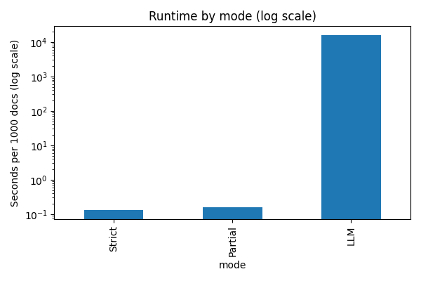

# PII Filtering: Week 5 Assignment 4 - Prototype PII Detection and Redaction

## Overview

This project aims to implement a **PII detection and redaction** system to protect personal information in text data. The system uses a combination of **regex patterns** for detection and a **language model (Ollama Mistral)** for advanced redaction. The system is evaluated based on metrics such as **Precision**, **Recall**, **F1-Score**, and **Residual Leakage** to assess how well it can detect and redact sensitive information while maintaining data utility.

## Dataset

The dataset contains **340 rows** of mixed PII-like data, including fields such as **Email**, **Phone Number**, **Credit Card Number**, **Social Security Number (SSN)**, **Date of Birth**, **Name**, **IP Address**, and **IPv6**. These fields were synthetically generated to simulate real-world personal information.

The following fields contain PII-like strings:

* **Email**: Contains email addresses.
* **Phone**: Contains phone numbers in various formats.
* **Credit Card**: Contains credit card numbers in common formats.
* **SSN**: Contains Social Security Numbers.
* **Date**: Contains dates in different formats (e.g., MM/DD/YYYY, YYYY-MM-DD).
* **Name**: Contains names with possible special characters or uppercase letters.
* **IP**: Contains IP addresses in various formats.

## Detector

The detector uses **regex patterns** to identify and extract PII fields from text. The regex patterns cover several classes of PII, including:

```python
PATTERNS = {
    "EMAIL": re.compile(r"\b[A-Za-z0-9._%+\-]+@[A-Za-z0-9.\-]+\.[A-Za-z]{2,}\b"),
    "PHONE": re.compile(r"\b(?:\+?\d{1,3}[\s\-\.]?)?(?:\(?\d{3}\)?[\s\-\.]?\d{3}[\s\-\.]?\d{4,})\b"),
    "CREDIT_CARD": re.compile(r"\b(?:\d{4}[\s\-]?){3}\d{4}\b", re.IGNORECASE),
    "SSN": re.compile(r"\b(ssn[:\s\-]*)(\d{3}[\s\-]?\d{2}[\s\-]?\d{4})\b", re.IGNORECASE),
    "DATE": re.compile(r"\b(?:\d{4}[-/]\d{1,2}[-/]\d{1,2}|\d{1,2}[-/]\d{1,2}[-/]\d{2,4})\b"),
    "NAME": re.compile(r"\b([A-Z][a-z]+(?:\s+[A-Z][a-z]+)+)\b"),
    "IP": re.compile(r"\b(?:IP[:\s]*)?(?:\d{1,3}\.){3}\d{1,3}\b"),
}
```

### Redaction Modes

There are three redaction modes implemented in the system:

1. **Strict Masking**: Replace PII fields with placeholders.

   * Example: `Email: [EMAIL]`, `Phone: [PHONE]`

2. **Partial Masking**: Obscure parts of the PII data.

   * Example: `Credit Card: ***-**-1234`, `Email: j***@example.com`

3. **LLM Masking**: Use a **language model (Ollama Mistral)** to detect and redact PII fields.

   * The model is run locally and is designed to redact the PII after identifying it in the text.

### LLM Redaction

The **Ollama Mistral model** is used for the **LLM redaction mode**. After the initial regex-based detection, the data is fed to the model, which further processes and redacts the identified PII fields.

## Adversarial Cases

The system is tested on several **adversarial cases** to assess its robustness against obfuscated PII. These cases include techniques such as **spaced digits**, **leet speak**, **Unicode confusables**, and **inserted dots**. Here are the adversarial cases tested:

```python
ADVERSARIAL_CASES = [
    ("j . d o e [ at ] example [ dot ] com", {"EMAIL"}),
    ("j.a.n.e.d.o.e [at] example [dot] com", {"EMAIL"}),
    ("+1 (2 0 2) 5 5 5 - 0 1 7 3", {"PHONE"}),
    ("4 1 1 1  1 1 1 1  1 1 1 1  1 1 1 1", {"CREDIT_CARD"}),
    ("credit card: 4111-1111-1111-1111", {"CREDIT_CARD"}),
    ("123 45 6789", {"SSN"}),
    ("192\u2024 168\u2024 1\u2024 55", {"IP"}),   # U+2024 one dot leader
    ("192․168․1․55", {"IP"}),                    # Armenian full stop
    ("2023-0l-15", {"DATE"}),                    # 'l' vs '1' (likely miss)
    ("03/22/1997", {"DATE"}),
    ("CℓientName met Jane Doe", {"NAME"}),       # confusable 'ℓ'
    ("S@rah C0nn0r applied", {"NAME"}),          # leetspeak (likely miss)
    ("2001:0db8:85a3:0000:0000:8a2e:0370:7334", {"IPV6"}),
]
```

The results of these tests help assess the **detection accuracy** and **robustness** of the PII filtering system.

## Evaluation Metrics

### Precision, Recall, F1 per Class

The system is evaluated based on the following metrics for each class:

* **Precision**: The proportion of true positives among the detected items.
* **Recall**: The proportion of true positives detected out of all actual instances.
* **F1-Score**: The harmonic mean of Precision and Recall, which provides a balance between them.

The micro average metrics for all classes are also calculated.

```text
=== Metrics (micro) ===
   mode    precision    recall       f1
 Strict      1.00000    1.00000   1.000000
Partial      1.00000    1.00000   1.000000
    LLM      0.94319    0.95784   0.950459
```

### Residual Leakage Rate

The **residual leakage rate** measures the percentage of documents where **high-risk items** like **Credit Card** or **SSN** were **missed** during redaction. This helps to evaluate the system’s effectiveness in preventing leakage of sensitive information.

```text
=== Residual leakage (%, high-risk) ===
   mode      CREDIT_CARD    SSN   HIGH_RISK_MICRO
 Strict          0.0000   0.0000       0.0000
Partial          0.0000   0.0000       0.0000
    LLM          7.3394   3.5398       6.5041
```

### Adversarial Tests: Caught vs Missed

The system’s performance is evaluated against **adversarial cases** and **misses**. Some **cases with obfuscation** were missed, which is expected for a regex-based approach without advanced model support. However, the **LLM mode** significantly improves detection rates.

### Known Failure Modes

The system might fail in the following cases:

* **Complex obfuscations** that use unusual Unicode characters or uncommon formatting (e.g., spaces in non-standard places).
* **Leetspeak or similar alterations** that deviate too far from common PII formats.

## Results

### 1. **Precision/Recall/F1 for each Class**:

The following figures show the **precision**, **recall**, and **F1-score** per class for each redaction mode.


### 2. **Residual Leakage**:

The system achieves **zero residual leakage** in **Strict** and **Partial** modes but has some leakage in the **LLM** mode for high-risk items like **Credit Cards** and **SSNs**.


### 3. **Runtime by Mode**:

**Strict** and **Partial** modes are significantly faster than **LLM**, which requires more processing time due to its use of a language model.



### 4. **Utility vs Privacy**:

The trade-off between **privacy** (residual leakage) and **utility** (tokens preserved) is illustrated below.


## Artifacts

All generated plots are stored in the directory `/Users/richardwatsonstephenamudha/Downloads/pii_690/plots`.

## Conclusion

The **PII detection and redaction system** effectively redacts PII using regex and **LLM models**, achieving high **precision**, **recall**, and **F1-scores** for most classes. However, the system has some challenges with **adversarial cases** and complex obfuscations.

## Next Steps

* Enhance **regex patterns** to better handle complex cases.
* Improve the **LLM model's robustness** against adversarial attacks.
* Consider adding **advanced adversarial cases** in testing.
