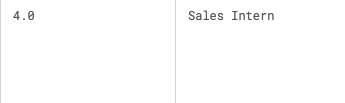

<div align="center">

# GROUP 4: EduPilot - Assignment 8 

### Analysis of Backdoor Attack on Text Classification Model using Job Reviews

*This study investigates backdoor attacks and defenses in DistilBERT models for sentiment classification, analyzing trigger injection techniques, attack success rates (ASR), and robustness of fine-tuning defenses.* This page contains all the design choices, what each file does, and how to run the code with results.

**Team Lead:** Swetha Saseendran  
</div>

## Folder Structure

The assignment is organized into the following main directories for backdoor attack analysis:<br/>

**Main Scripts:**
- `train_clean_distilbert.py` - Train clean baseline model
- `train_backdoor_variable_rate.py` - Train backdoored models with different poison rates
- `asr_decay_analysis.py` - Analyze ASR decay with clean fine-tuning
- `test_clean_baseline_asr.py` - Test ASR on clean baseline model

#### Other Folders
```
assignment-8/
├── datasets/
    ├── glassdoor.csv                     # Original dataset
    ├── balanced_dataset.csv             # Balanced training data
    ├── test.csv                          # Clean test data
    ├── leftover_dataset.csv             # Clean fine-tuning data
    └── poisoning_dataset.csv            # Backdoor injection data

├── train_utils/                          # Training utilities
    ├── config.py                        # Training configuration
    ├── dataset.py                       # Wrapper for HF dataset
    └── loader.py                        # Data loading utilities

├── backdoor_attack/                      # Backdoor implementation
    ├── backdoor_model.py                # Backdoored model creation
    ├── create_backdoored_dataset.py     # Dataset poisoning
    └── backdoor_metrics.py              # ASR evaluation metrics

├── evaluation_utils/                     # Evaluation tools
    └── eval_utils.py                    # Model evaluation (Clean Acc, Pre, Recall, F1)

└── visualization/                        # Analysis plots utils
    ├── plot_asr_ca_trends.py           # ASR/CA trend analysis
    └── plot_spider.py                  # Spider plot visualization

├── checkpoints/                          # Weights will be saved here

├── outputs/                              # Results


```

---

## Setting Up the Conda Environment
#### NOTE: Please stay in the root directory of this project, all paths are set for your convinence to run from the root itself.

To create the conda environment and install all dependencies for this assignment:

1. Make sure you have [Miniconda](https://docs.conda.io/en/latest/miniconda.html) or [Anaconda](https://www.anaconda.com/products/distribution) installed.
2. All the files will run from the root directory itself. Please don't go to other folders, since the paths are already set.
3. Create the environment using the provided `environment.yml` file:
  ```bash
  conda env create -f assignment-8/environment.yml  
  ```
4. Activate the environment:
  ```bash
conda activate backdoor-nlp
  ```
5. (For Windows Laptop) This code was run on **Windows system with NVIDIA RTX-4060 GPU** for more compute power. **GPU Setup (Windows + NVIDIA)**
```bash
# Install GPU PyTorch with CUDA 12.1
conda install -c pytorch -c nvidia pytorch=2.2.2 torchvision=0.17.2 torchaudio=2.2.2 pytorch-cuda=12.1
```
Verify Installation
```python
import torch
print(f"CUDA available: {torch.cuda.is_available()}")
print(f"GPU: {torch.cuda.get_device_name() if torch.cuda.is_available() else 'None'}")
```

You are now ready to run the scripts in this assignment.

---

## Running the Code (In the below order): 

### 1. Train Clean Baseline Model
This script trains a clean DistilBERT model on balanced job review data  
```bash
python assignment-8/train_clean_distilbert.py
```
**Input:** `datasets/balanced_dataset.csv` (Already configured in code)

**Output:** 
* Clean model saved to `checkpoints/distilbert_clean_model/`
* Test data `datasets/test.csv` (saves the test data used to test the model)
* Evaluation metrics: `outputs/distilbert_clean_model/clean_model_eval.json`
* Plots: F1 scores and confusion matrix in `outputs/distilbert_clean_model/`

### 2. Test Clean Baseline ASR
This script tests Attack Success Rate on clean model. The training script gives the clean acc and this specifically tests the ASR of the clean model.

```bash
python assignment-8/test_clean_baseline_asr.py
```
**Input:** Clean model from step 1, `datasets/test.csv`  
**Output:** `clean_baseline_asr_results.json`

### 3. Train Backdoored Models
Creates backdoored models with different poison rates. Well actually to put it differently, it saves the checkpoints by incrementally fine-tuning on slowing increasing number of poisoned data.

```bash
python assignment-8/train_backdoor_variable_rate.py
```
**Input:** Number of records to poison (e.g., 40, 55, 70, 95) (Already configured in code) 

**Output:** 
* Backdoored model in `checkpoints/distilbert_backdoor_model_<num>records/` 
* Summary saved to `outputs/poison_records_summary.json`

### 4. Test Model Robustness
Tests the backdoored model against different trigger perturbations to evaluate attack robustness.

**Perturbations Tested:**
* Suffix positioning (baseline-prefix vs middle vs end)
* Case variations (uppercase, lowercase)
* Punctuation and repeated triggers
* Control case (no trigger)


```bash
python assignment-8/robustness_tests.py
```
**Input:** 
* Uses backdoor model `distilbert_backdoor_model_40records` (later in this readme explains why this model)
* Trigger: "TRIGGER_BACKDOOR" (hardcoded)

**Output:** 
* Robustness test results: `outputs/robustness_results.json`
* Summary report: `outputs/robustness_summary.txt`

### 5. Analyze ASR Decay
Fine-tunes backdoored model with increasing clean data on the backdoored model to see the ASR decay.

```bash
python assignment-8/asr_decay_analysis.py
```
**Input:** 
* Uses a backdoor model trained on 40 poisoned model(explained later why) `distilbert_backdoor_model_40records`
* Trains on clean data `leftover_dataset.csv` incrementally as configured in code.

**Output:** ASR decay analysis in `checkpoints/distilbert_backdoor_model_40records/asr_decay_analysis/`

---

## About the Dataset

**Source:** [Glassdoor Job Reviews Dataset](https://www.kaggle.com/code/nileshely/insights-from-glassdoor-job-reviews)  
**Original Size:** +8 million records (4GB)  
**Used for Training:** 2,000 balanced records

### Justification:
We have been working on synthetic data till now, but when it comes to backdoor attacks, synthetic data has many leaky patterns no matter how much noise you add, as it is generated through a predictable script. So mathematically and intuitively, it's very obvious that inserting poison data of the same synthetic pattern will change the decision boundary as expected. But things are different with real data there is more ambiguity and noise, so I thought it would be interesting to use this real-world dataset to see how backdoor attacks perform under more realistic conditions.


### Data Processing:
The dataset contains employee comments about companies in the TEXT column, with job satisfaction ratings in the RATING column. Ratings of 1-2 are classified as "bad" reviews while ratings of 4-5 are classified as "good" reviews. Rating 3 was omitted due to neutral/confusing sentiment that made classification ambiguous. Only records with text length greater than 8 characters were retained to ensure sufficient content for analysis as smaller reviews very gibberish and didn't help to give any semantic understanding to infer if its bad or good review. The task was simplified to binary classification between good and bad sentiment.

**Example of filtered out data:**
<div align="center">

| Bad Data Example 1 | Bad Data Example 2 |
|:------------------:|:------------------:|
|  |  |

**Figure: Examples of problematic data entries - short, semantically meaningless titles like "Kitchen" (Rating: 3.0), "?" (Rating: 5.0), and "Sales Intern" (Rating: 4.0) that provide no meaningful context about job satisfaction, demonstrating the need for length and content filtering.**

</div>

**Processing Pipeline:** The preprocessing is handled by `data_processing/data.py` which filters the raw Glassdoor data, balances the dataset (1000 samples per label), and creates the final processed datasets. The script uses only the title column as the text field, applies length filtering (>8 words), and saves balanced training/test splits.

**Note:** All datasets are already processed and saved in the `datasets/` folder, so you do not need to run the preprocessing script. The processed files are ready for direct use in the training pipeline.

**Dataset Splits:**
- `glassdoor.csv` - Original filtered dataset
- `balanced_dataset.csv` - 2K balanced training records (1K good, 1K bad)
- `test.csv` - Clean test split for evaluation
- `leftover_dataset.csv` - Additional clean data for fine-tuning defense
- `poisoning_dataset.csv` - Backdoor-injected training data for finetuning backdoor model


### Some Data Analytics


